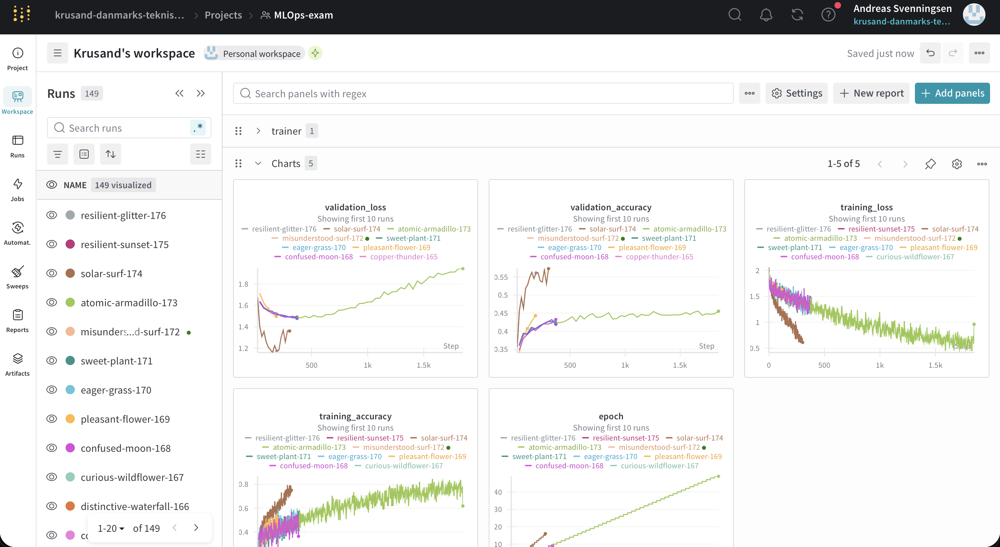
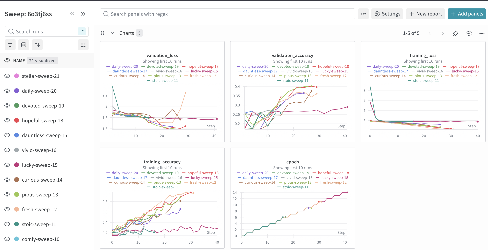
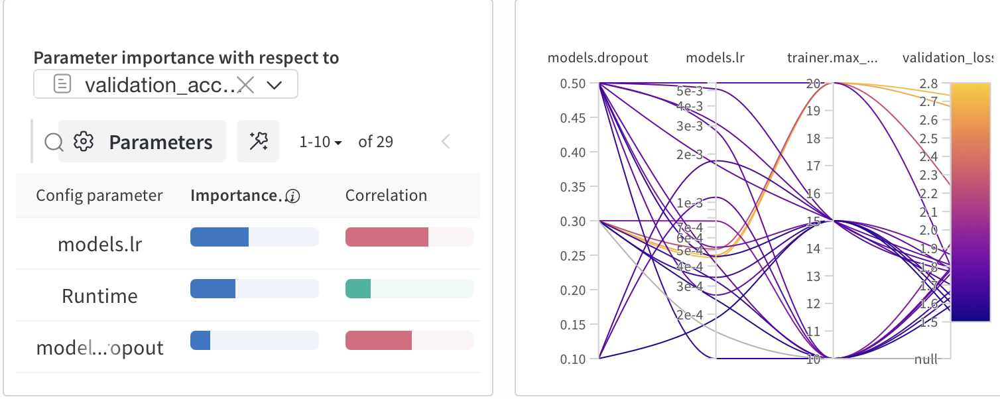
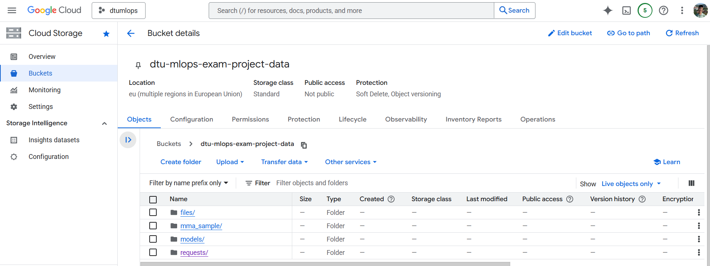
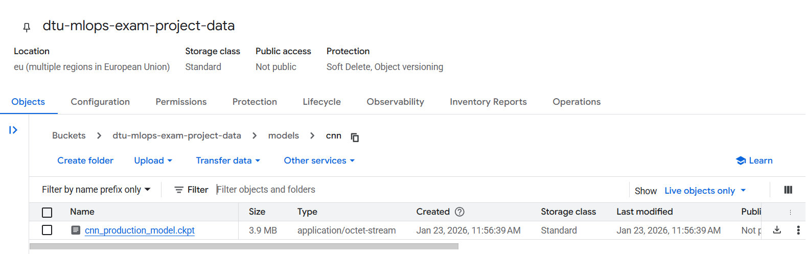
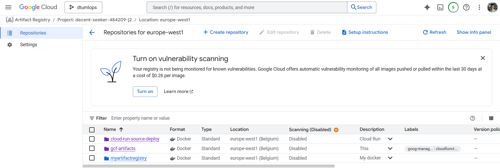
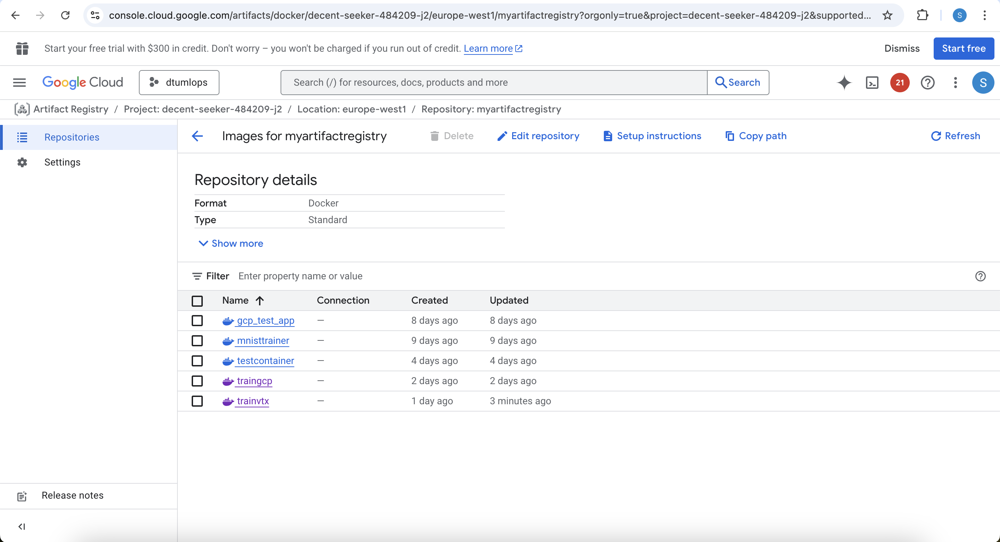
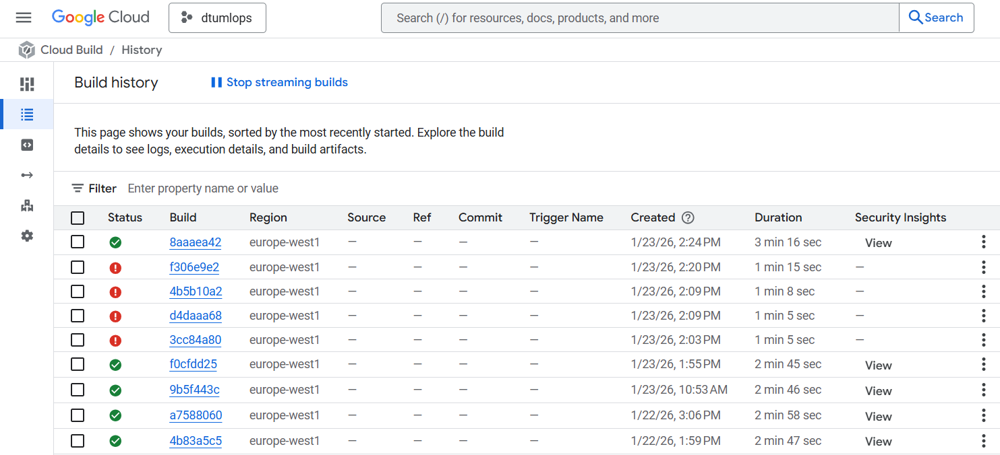
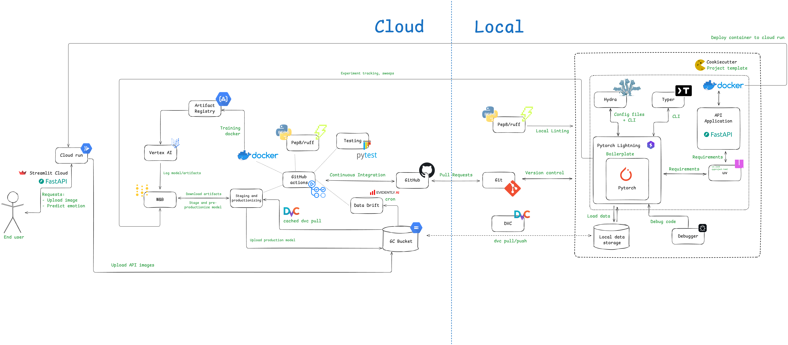

# Exam template for 02476 Machine Learning Operations

This is the report template for the exam. Please only remove the text formatted as with three dashes in front and behind
like:

```--- question 1 fill here ---```

Where you instead should add your answers. Any other changes may have unwanted consequences when your report is
auto-generated at the end of the course. For questions where you are asked to include images, start by adding the image
to the `figures` subfolder (please only use `.png`, `.jpg` or `.jpeg`) and then add the following code in your answer:

``

In addition to this markdown file, we also provide the `report.py` script that provides two utility functions:

Running:

```bash
python report.py html
```

Will generate a `.html` page of your report. After the deadline for answering this template, we will auto-scrape
everything in this `reports` folder and then use this utility to generate a `.html` page that will be your serve
as your final hand-in.

Running

```bash
python report.py check
```

Will check your answers in this template against the constraints listed for each question e.g. is your answer too
short, too long, or have you included an image when asked. For both functions to work you mustn't rename anything.
The script has two dependencies that can be installed with

```bash
pip install typer markdown
```

or

```bash
uv add typer markdown
```

## Overall project checklist

The checklist is *exhaustive* which means that it includes everything that you could do on the project included in the
curriculum in this course. Therefore, we do not expect at all that you have checked all boxes at the end of the project.
The parenthesis at the end indicates what module the bullet point is related to. Please be honest in your answers, we
will check the repositories and the code to verify your answers.

### Week 1

* [x] Create a git repository (M5)
* [x] Make sure that all team members have write access to the GitHub repository (M5)
* [x] Create a dedicated environment for you project to keep track of your packages (M2)
* [x] Create the initial file structure using cookiecutter with an appropriate template (M6)
* [x] Fill out the `data.py` file such that it downloads whatever data you need and preprocesses it (if necessary) (M6)
* [x] Add a model to `model.py` and a training procedure to `train.py` and get that running (M6)
* [x] Remember to either fill out the `requirements.txt`/`requirements_dev.txt` files or keeping your
    `pyproject.toml`/`uv.lock` up-to-date with whatever dependencies that you are using (M2+M6)
* [x] Remember to comply with good coding practices (`pep8`) while doing the project (M7)
* [x] Do a bit of code typing and remember to document essential parts of your code (M7)
* [x] Setup version control for your data or part of your data (M8)
* [x] Add command line interfaces and project commands to your code where it makes sense (M9)
* [x] Construct one or multiple docker files for your code (M10)
* [x] Build the docker files locally and make sure they work as intended (M10)
* [x] Write one or multiple configurations files for your experiments (M11)
* [x] Used Hydra to load the configurations and manage your hyperparameters (M11)
* [ ] Use profiling to optimize your code (M12)
* [x] Use logging to log important events in your code (M14)
* [x] Use Weights & Biases to log training progress and other important metrics/artifacts in your code (M14)
* [x] Consider running a hyperparameter optimization sweep (M14)
* [x] Use PyTorch-lightning (if applicable) to reduce the amount of boilerplate in your code (M15)

### Week 2

* [x] Write unit tests related to the data part of your code (M16)
* [x] Write unit tests related to model construction and or model training (M16)
* [x] Calculate the code coverage (M16)
* [x] Get some continuous integration running on the GitHub repository (M17)
* [x] Add caching and multi-os/python/pytorch testing to your continuous integration (M17)
* [x] Add a linting step to your continuous integration (M17)
* [ ] Add pre-commit hooks to your version control setup (M18)
* [x] Add a continues workflow that triggers when data changes (M19)
* [x] Add a continues workflow that triggers when changes to the model registry is made (M19)
* [x] Create a data storage in GCP Bucket for your data and link this with your data version control setup (M21)
* [x] Create a trigger workflow for automatically building your docker images (M21)
* [x] Get your model training in GCP using either the Engine or Vertex AI (M21)
* [x] Create a FastAPI application that can do inference using your model (M22)
* [x] Deploy your model in GCP using either Functions or Run as the backend (M23)
* [x] Write API tests for your application and setup continues integration for these (M24)
* [ ] Load test your application (M24)
* [ ] Create a more specialized ML-deployment API using either ONNX or BentoML, or both (M25)
* [x] Create a frontend for your API (M26)

### Week 3

* [x] Check how robust your model is towards data drifting (M27)
* [x] Setup collection of input-output data from your deployed application (M27)
* [ ] Deploy to the cloud a drift detection API (M27)
* [x] Instrument your API with a couple of system metrics (M28)
* [x] Setup cloud monitoring of your instrumented application (M28)
* [x] Create one or more alert systems in GCP to alert you if your app is not behaving correctly (M28)
* [x] If applicable, optimize the performance of your data loading using distributed data loading (M29)
* [x] If applicable, optimize the performance of your training pipeline by using distributed training (M30)
* [x] Play around with quantization, compilation and pruning for you trained models to increase inference speed (M31)

### Extra

* [ ] Write some documentation for your application (M32)
* [ ] Publish the documentation to GitHub Pages (M32)
* [x] Revisit your initial project description. Did the project turn out as you wanted?
* [x] Create an architectural diagram over your MLOps pipeline
* [x] Make sure all group members have an understanding about all parts of the project
* [x] Uploaded all your code to GitHub

## Group information

### Question 1
> **Enter the group number you signed up on <learn.inside.dtu.dk>**
>
> Answer:

29

### Question 2
> **Enter the study number for each member in the group**
>
> Example:
>
> *sXXXXXX, sXXXXXX, sXXXXXX*
>
> Answer:

s214618, s260006, s254120, s253844

### Question 3
> **Did you end up using any open-source frameworks/packages not covered in the course during your project? If so**
> **which did you use and how did they help you complete the project?**
>
> Recommended answer length: 0-200 words.
>
> Example:
> *We used the third-party framework ... in our project. We used functionality ... and functionality ... from the*
> *package to do ... and ... in our project*.
>
> Answer:

We did not use other open source frameworks, but we considered using MLFlow

## Coding environment

> In the following section we are interested in learning more about you local development environment. This includes
> how you managed dependencies, the structure of your code and how you managed code quality.

### Question 4

> **Explain how you managed dependencies in your project? Explain the process a new team member would have to go**
> **through to get an exact copy of your environment.**
>
> Recommended answer length: 100-200 words
>
> Example:
> *We used ... for managing our dependencies. The list of dependencies was auto-generated using ... . To get a*
> *complete copy of our development environment, one would have to run the following commands*
>
> Answer:

We used `uv` as we found it as a simple and effective tool to handle dependencies. When using the project template (see Question 5) it already contained a `pyproject.toml` and `uv.lock` file. Thus, it was not necessarily to initialize `uv` by running `uv init <project_name>`. Whenever a new dependency was added, we used the `uv add <dependency_name>` command and the corresponding dependency was added to the `pyproject.toml` file. The specific version was added to the `uv.lock` file.  
For a new team member to get an exact copy of our uv environment, he/she will have to first clone our repository by running `git clone https://github.com/krusand/dtu-mlops-exam-project.git`. Once the repository is cloned, the new team member should download `uv` following [this installation guide](https://docs.astral.sh/uv/getting-started/installation/) and then run `uv sync`. 

### Question 5

> **We expect that you initialized your project using the cookiecutter template. Explain the overall structure of your**
> **code. What did you fill out? Did you deviate from the template in some way?**
>
> Recommended answer length: 100-200 words
>
> Example:
> *From the cookiecutter template we have filled out the ... , ... and ... folder. We have removed the ... folder*
> *because we did not use any ... in our project. We have added an ... folder that contains ... for running our*
> *experiments.*
>
> Answer:

As expected we used the [course cookiecutter template](https://github.com/SkafteNicki/mlops_template) to structure our project repository. The main folder is `src/exam_project`, which contains all our scripts and config files. The `configs` folder is located at the root in the template, but we decided to move it inside the `src/exam_project` folder. In this way the config files are stored closer to the scripts which are the ones being configured. Other important folders include `dvc`, `.github/workflows`, `dockerfiles`, `reports`, and `tests`. The folder names of these folders should clearly indicate what they contain. The project template includes a `requirements.txt` file, but we are not including this in our repository since we are using `uv` for managing dependencies.  

### Question 6

> **Did you implement any rules for code quality and format? What about typing and documentation? Additionally,**
> **explain with your own words why these concepts matters in larger projects.**
>
> Recommended answer length: 100-200 words.
>
> Example:
> *We used ... for linting and ... for formatting. We also used ... for typing and ... for documentation. These*
> *concepts are important in larger projects because ... . For example, typing ...*
>
> Answer:

We are using `ruff` for linting as part of a GitHub workflow triggered on every push and pull-request to the main branch. The workflow is defined by the `linting.yaml` file in the `.github/workflows` folder and runs `ruff check src/exam_project/.`. In this way we ensure that our scripts follow the same overall formatting, e.g. no unused imports. When defining a function, we made sure to apply typing for the input arguments as well as the output variable(s). When details related to any code were important and/or unintuitive we found it useful to add a small comment explaining what is going on, e.g. the dimensions of a tensor or skipping an iteration in a loop. 

We believe the concepts of formatting, typing and documentation makes it easier for larger teams to share their code and collaborate in general. When receiving a piece of code, e.g. a function, or a class, it is much easier to understand how it is working if the code is well-documented and uses proper typing. Using formatting can improve the understandability even more and just in general help aligning the code format across developers. 

## Version control

> In the following section we are interested in how version control was used in your project during development to
> corporate and increase the quality of your code.

### Question 7

> **How many tests did you implement and what are they testing in your code?**
>
> Recommended answer length: 50-100 words.
>
> Example:
> *In total we have implemented X tests. Primarily we are testing ... and ... as these the most critical parts of our*
> *application but also ... .*
>
> Answer:

In total we have implemented 12 tests. Primarily we are testing the data, the models and the api as these are the most critical parts of our emotion classification app. We tested whether our code would execute and behave the way we intended for the workflow we chose for this project. For the data and models, we tested things such as shape and reproducability. The api was tested by requesting the Cloud Run and checking various headers that are correct/incorrect. We tested using Linux, Windows and Macos and different Python versions.

### Question 8

> **What is the total code coverage (in percentage) of your code? If your code had a code coverage of 100% (or close**
> **to), would you still trust it to be error free? Explain you reasoning.**
>
> Recommended answer length: 100-200 words.
>
> Example:
> *The total code coverage of code is X%, which includes all our source code. We are far from 100% coverage of our **
> *code and even if we were then...*
>
> Answer:

The total code coverage of code is 14%, which includes all our source code. This is far from 100% coverage, but it makes sense since we, for example, test the built API on Google Run rather than testing the API code directly. Even if we achieved 100% code coverage, it would not guarantee that the code is error-free. Code coverage only measures the lines of code executed during tests, not whether the tests themselves are comprehensive or cover all edge cases. Furthermore, earlier in the project the reported coverage was higher, but the percentage alone is not a reliable indicator of quality. As more parts of the system were added (e.g., frontend), the overall number changed, highlighting areas where we have not yet implemented unit testing.

### Question 9 (Sam)

> **Did you workflow include using branches and pull requests? If yes, explain how. If not, explain how branches and**
> **pull request can help improve version control.**
>
> Recommended answer length: 100-200 words.
>
> Example:
> *We made use of both branches and PRs in our project. In our group, each member had an branch that they worked on in*
> *addition to the main branch. To merge code we ...*
>
> Answer:

We did collaborative code development using branches, PRs and code reviews. Our strategy was to have main as a protected branch, meaning a push to main was allowed only via a pull request for another branch to be merged into main. To implement new features, we branched off main, developed, git pushed our commits, then made a PR that was reviewed by another member. After all tests/checks passed the PR and merge was completed and the feature branch deleted.

### Question 10

> **Did you use DVC for managing data in your project? If yes, then how did it improve your project to have version**
> **control of your data. If no, explain a case where it would be beneficial to have version control of your data.**
>
> Recommended answer length: 100-200 words.
>
> Example:
> *We did make use of DVC in the following way: ... . In the end it helped us in ... for controlling ... part of our*
> *pipeline*
>
> Answer:

We set up DVC for our project. First we downloaded and preprocessed our data from kaggle. Then we created a bucket on Google Storage via GCP. We set the dvc remote storage for our repo to be this bucket, then dvc added and pushed our dvc data hash to the remote repository. We made sure also to git commit the dvc files with a commit tag denoting that this was version 1 of the dataset. This means a future user can always revert back to this git commit and dvc pull from there to get that specific version of the data. Throughout our project we execute uv run dvc pull to pull in the correct version of the data. For upgrading a model from staging to production we make use of caching to speed up dvc pull.

### Question 11

> **Discuss you continuous integration setup. What kind of continuous integration are you running (unittesting,**
> **linting, etc.)? Do you test multiple operating systems, Python  version etc. Do you make use of caching? Feel free**
> **to insert a link to one of your GitHub actions workflow.**
>
> Recommended answer length: 200-300 words.
>
> Example:
> *We have organized our continuous integration into 3 separate files: one for doing ..., one for running ... testing*
> *and one for running ... . In particular for our ..., we used ... .An example of a triggered workflow can be seen*
> *here: <weblink>*
>
> Answer:

We used Github actions to orchestrate the workflows. We have 7 workflows.
- Check for linting
- Tests and coverage
- Detect data drift
- Staging and pre-productionizing
- Upload production model to gc bucket
- Vertex Docker image
- Check for dataset changes

Generally, we cached the uv setup, and dvc data. The dvc cache had a large impact on runtimes, going from 10 minutes of pulling data, to 15 seconds. 

We ran linting and unittesting (Tests and coverage) on three different operating systems (macOS, ubuntu, Windows) and two different python versions (3.12, 3.13). These were triggered by pushes to main or pull requests. Vertex docker image was also triggered by pushes to main or pull requests, but would make a dry run on pull request triggers. 

We had one workflow which only triggered on pull requests with data changes. This would use CML to make a comment with a report of dataset statistics to the pull request. Thus before merging to main, we could see if the data was changed. 

One workflow triggered periodically, every day at 23:30, using a cron scheduler. This job tested the data drift of the images uploaded to the frontend. We did not make a trigger for re-training, since our data is static. 

Two workflows (staging and pre-productionizing) and (upload production model to gc bucket) were triggered by repository dispatches. They were triggered by a WandB. In combination, these enabled a trained model to go from staging to production, undergoing some testing. These workflows essentially implemented the continuous machine learning part, as we did not have to do anything when a model was trained. If the model was better than the production model, it would deploy automatically. Other options would have been to manually deploy the model, however we decided against this. 
These two workflows had a concurrency group per model architecture. We did this to ensure two train scripts didn't interefere with the staging and productionizing of the model (for example the problem of race conditions). 
Examples of runs:
- [Staged and preproductioned model workflow](https://github.com/krusand/dtu-mlops-exam-project/actions/runs/21283678975). Look at identify_event.check_event_type to see the payload. Look at test_and_pre_productionize.run_model_test and pre-productionize_model. 
- [Production model workflow](https://github.com/krusand/dtu-mlops-exam-project/actions/runs/21283721511). Look at identify_event.check_event_type to see the payload. Look at upload_model.upload_model_to_GC_bucket to see the upload part.

## Running code and tracking experiments

> In the following section we are interested in learning more about the experimental setup for running your code and
> especially the reproducibility of your experiments.

### Question 12

> **How did you configure experiments? Did you make use of config files? Explain with coding examples of how you would**
> **run a experiment.**
>
> Recommended answer length: 50-100 words.
>
> Example:
> *We used a simple argparser, that worked in the following way: Python  my_script.py --lr 1e-3 --batch_size 25*
>
> Answer:

We used a Hydra config files that worked using: uv run train models=cnn data.batch_size=256 hyperparameters.seed=420 models.lr=0.001And so forth. We use a train.yaml file which refers to other .yaml files, for example models.yaml and data.yaml . The above example would run an experiment using the cnn model, a batch size of 256, a seed of 420 and a learning rate of 0.001. All other parameters are the default parameters as configured in the config files referred to by train.yaml.

### Question 13 

> **Reproducibility of experiments are important. Related to the last question, how did you secure that no information**
> **is lost when running experiments and that your experiments are reproducible?**
>
> Recommended answer length: 100-200 words.
>
> Example:
> *We made use of config files. Whenever an experiment is run the following happens: ... . To reproduce an experiment*
> *one would have to do ...*
>
> Answer:

We used Hydra in combination with WandB. We logged the full Hydra config to the WandB run, as well as loss and accuracy. When we run an experiment using uv run train, it uses the Hydra config files, and defaulting to the ann model. We always use a seed, which can also be looked up in the WandB run, because the whole config is tracked. To reproduce an experiment, one should find the run in WandB, go to the overview, and run the exact same command listed under "Command". In our case, to reproduce experiment resilient-glitter-176, one would run /app/src/exam_project/train.py models=cnn data.batch_size=256 trainer.max_epochs=10. Since this was run on Vertex AI, it says /app/. This is not needed locally.

### Question 14

> **Upload 1 to 3 screenshots that show the experiments that you have done in W&B (or another experiment tracking**
> **service of your choice). This may include loss graphs, logged images, hyperparameter sweeps etc. You can take**
> **inspiration from [this figure](figures/wandb.png). Explain what metrics you are tracking and why they are**
> **important.**
>
> Recommended answer length: 200-300 words + 1 to 3 screenshots.
>
> Example:
> *As seen in the first image when have tracked ... and ... which both inform us about ... in our experiments.*
> *As seen in the second image we are also tracking ... and ...*
>
> Answer:

We use WandB to track experiments and sweeps. As seen in two images, we tracked validation loss and validation accuracy, aswell as training loss and training accuracy. Furthermore the epoch number. The training loss is important because it can be used to see whether the model actually works. Training loss should go down every epoch. If it suddenly goes up, there clearly is a mistake in the code. Validation loss is important, because it shows when the model starts overfitting. Thus we can see when the Earlystopping callback would kick in. The validation accuracy thus informs us what the expected accuracy would be in the real world.For the sweeps, we didn't run this fully, since some of our models took a long time to train, but we tracked the validation loss and accuracy for this as well. We optimised hyperparameters like model dropout, learning rate and the number of epochs for the sweeps. The sweeps use a bayesian hyperparameter tuning strategy, which is efficient.





### Question 15

> **Docker is an important tool for creating containerized applications. Explain how you used docker in your**
> **experiments/project? Include how you would run your docker images and include a link to one of your docker files.**
>
> Recommended answer length: 100-200 words.
>
> Example:
> *For our project we developed several images: one for training, inference and deployment. For example to run the*
> *training docker image: `docker run trainer:latest lr=1e-3 batch_size=64`. Link to docker file: <weblink>*
>
> Answer:

We use docker images and containers for training with Vertex AI. The train_vertex.dockerfile defines an image that copies the source project, uv.lock and .dvc files; it then uv syncs and executes an entrypoint.sh file; the entrypoint sets the remote storage to be the GC bucket, dvc pulls the data, then executes the train.py script, including optional command line arguments. We build the docker image and push it to our GC artifact registry whenever there is a push to the main branch; this is facilitated via a GitHub workflow. The containerised train script allows for reproducability and robustness for training models, and allows for Vertex AI tooling to be leveraged. We used a Dockerfile to package the FastAPI app into a container image for Cloud Run. The image starts installs uv, copies in the dependency files (pyproject.toml, uv.lock) and installs dependencies, then copies the source code. Finally, it defines an entrypoint that starts the API with Uvicorn on 0.0.0.0:8080, which is the port Cloud Run expects.

### Question 16

> **When running into bugs while trying to run your experiments, how did you perform debugging? Additionally, did you**
> **try to profile your code or do you think it is already perfect?**
>
> Recommended answer length: 100-200 words.
>
> Example:
> *Debugging method was dependent on group member. Some just used ... and others used ... . We did a single profiling*
> *run of our main code at some point that showed ...*
>
> Answer:

We used the built-in Python debugger in VS Code. It allowed us to set checkpoints for the part of the code that we suspected to be causing the bug. In this way it was possible to check the type and value of each variable without having to write print statements, which would have to be deleted after performing the debugging.  

We did not perform any profiling as we wanted to make the basics of our code work first. When reachiing week 2 and 3 of the project we spent a lot of time on integrating different frameworks with each other. Thus, we did not have time to perform proper profiling of our code, even though it could have helped us identifying points for optimization. When training our models (ANN, CNN, ViT), we could also see from the wandb experiments, that the ViT model was the bottleneck in terms of training. This was another reason for why did not perform profiling. 

## Working in the cloud

> In the following section we would like to know more about your experience when developing in the cloud.

### Question 17

> **List all the GCP services that you made use of in your project and shortly explain what each service does?**
>
> Recommended answer length: 50-200 words.
>
> Example:
> *We used the following two services: Engine and Bucket. Engine is used for... and Bucket is used for...*
>
> Answer:

For training we make use of an artifact registry (for storing the training docker image), a GCP bucket (for storing the data that the train script utilises) and Vertex AI (for executing training). For the API, we used Cloud Run and a Bucket. The API ran on Cloud Run, and when it received a request with the required headers, it loaded the specified model from a folder in the bucket, generated a prediction and then stored the uploaded image along with the user’s label and the model’s prediction.

### Question 18

> **The backbone of GCP is the Compute engine. Explained how you made use of this service and what type of VMs**
> **you used?**
>
> Recommended answer length: 100-200 words.
>
> Example:
> *We used the compute engine to run our ... . We used instances with the following hardware: ... and we started the*
> *using a custom container: ...*
>
> Answer:

We used Vertex AI for training instead of Compute Engine. We only needed this for training and Vertex AI is specially built for this, whereas Compute Engine is more for general purpose tasks.

### Question 19

> **Insert 1-2 images of your GCP bucket, such that we can see what data you have stored in it.**
> **You can take inspiration from [this figure](figures/bucket.png).**
>
> Answer:
Bucket overview:
  

CNN model blob:


### Question 20

> **Upload 1-2 images of your GCP artifact registry, such that we can see the different docker images that you have**
> **stored. You can take inspiration from [this figure](figures/registry.png).**
>
> Answer:




### Question 21

> **Upload 1-2 images of your GCP cloud build history, so we can see the history of the images that have been build in**
> **your project. You can take inspiration from [this figure](figures/build.png).**
>
> Answer:



### Question 22

> **Did you manage to train your model in the cloud using either the Engine or Vertex AI? If yes, explain how you did**
> **it. If not, describe why.**
>
> Recommended answer length: 100-200 words.
>
> Example:
> *We managed to train our model in the cloud using the Engine. We did this by ... . The reason we choose the Engine*
> *was because ...*
>
> Answer:

Training was successfully performed with Vertex AI. We provide the VERTEXAI.md describing the steps to do this. Firstly the docker image for training is built (this is done either manually, or automatically as part of our GitHub workflow when we push to main); this builds and pushes the docker image to our GCP artifact registry. A service account was created and setup with the necessary roles for reading from the bucket and artifact registry, and running the Vertex AI job (roles including storage.objectAdmin, aiplatform.user). Finally the vertex_ai_job.yaml is required to configure the run; this includes the machine specifications, the image specifications (including environment variables), the service account, and any other optional arguments for the job that would ordinarily be included as command line arguments (e.g. the model type, model hyperparameters, number of epochs, batch size etc.). The train script utilises wandb for logging; an early stopping checkpoint and model checkpoint identifies the best model, which is then saved as an artifact and stored in the wandb registry.

## Deployment

### Question 23

> **Did you manage to write an API for your model? If yes, explain how you did it and if you did anything special. If**
> **not, explain how you would do it.**
>
> Recommended answer length: 100-200 words.
>
> Example:
> *We did manage to write an API for our model. We used FastAPI to do this. We did this by ... . We also added ...*
> *to the API to make it more ...*
>
> Answer:

We did manage to write an API for our model using FastAPI. The API exposes a /predict endpoint that accepts an uploaded image (and an optional manual label and model name), preprocesses the image by converting it to grayscale and resizing it to 48×48 and then runs inference with a PyTorch model in evaluation mode. A small “special” part is that the service can dynamically load different model checkpoints from the Bucket (controlled via environment variables), which makes it easy to switch models without redeploying code. We also added simple request validation by requiring specific headers (authorization and JSON accept) and the API can log requests by saving the uploaded image plus metadata (user label, prediction, confidence, checkpoint path, timestamp) to the Bucket.

### Question 24

> **Did you manage to deploy your API, either in locally or cloud? If not, describe why. If yes, describe how and**
> **preferably how you invoke your deployed service?**
>
> Recommended answer length: 100-200 words.
>
> Example:
> *For deployment we wrapped our model into application using ... . We first tried locally serving the model, which*
> *worked. Afterwards we deployed it in the cloud, using ... . To invoke the service an user would call*
> *`curl -X POST -F "file=@file.json"<weburl>`*
>
> Answer:

--- question 24 fill here ---

### Question 25

> **Did you perform any functional testing and load testing of your API? If yes, explain how you did it and what**
> **results for the load testing did you get. If not, explain how you would do it.**
>
> Recommended answer length: 100-200 words.
>
> Example:
> *For functional testing we used pytest with httpx to test our API endpoints and ensure they returned the correct*
> *responses. For load testing we used locust with 100 concurrent users. The results of the load testing showed that*
> *our API could handle approximately 500 requests per second before the service crashed.*
>
> Answer:

For unit testing we used pytest by treating the FastAPI service as a black box and sending real HTTP requests to the deployed Cloud Run endpoint. The tests cover header validation (missing/invalid authorization and accept headers), file handling (missing file, valid file upload) and response correctness (HTTP 200, JSON content-type, required response fields, valid emotion label, and confidence). Because Cloud Run can have cold starts and transient failures, we added a retry helper with a long timeout and exponential backoff for timeouts and rate-limiting (429). We also included a simple consistency check to ensure the same image produces the same prediction and probability output across repeated calls. We did not run a dedicated load test in this setup, but to do so, we would script concurrent requests against /predict and measure latency/throughput and the point at which Cloud Run begins returning 429 responses.

### Question 26

> **Did you manage to implement monitoring of your deployed model? If yes, explain how it works. If not, explain how**
> **monitoring would help the longevity of your application.**
>
> Recommended answer length: 100-200 words.
>
> Example:
> *We did not manage to implement monitoring. We would like to have monitoring implemented such that over time we could*
> *measure ... and ... that would inform us about this ... behaviour of our application.*
>
> Answer:

We are not monitoring our deployed model directly. However, a data drift report is generated by the `data_drift.yaml` workflow which includes a csv file containing the model accuracies and f1-scores on the images that have been uploaded through the API frontend in the last 2 weeks. This is not traditional monitoring, but it can help identifying a potential data drift and provide some guidance on whether the models should be re-trained on the new image data.  

We are also monitoring our API through Cloud Run on GCP. An alert has been set up to ensure we are getting notified if our API is down. 

## Overall discussion of project

> In the following section we would like you to think about the general structure of your project.

### Question 27

> **How many credits did you end up using during the project and what service was most expensive? In general what do**
> **you think about working in the cloud?**
>
> Recommended answer length: 100-200 words.
>
> Example:
> *Group member 1 used ..., Group member 2 used ..., in total ... credits was spend during development. The service*
> *costing the most was ... due to ... . Working in the cloud was ...*
>
> Answer:

We spent $3.96 (reflecting the total costs across our project combined with the learning exercises from one member of the team). The most costly services were Compute Engine ($1.82), Cloud Storage ($0.61), Cloud Run Functions ($0.60), Artifact Registry ($0.52) and Vertex AI ($0.28). The Compute Engine was primarily used for learning exercises so this can be ignored when considering project costs. The Cloud Storage was used for storing our data and production models, and dvc did not work with Google Drive, so this cost was worthwhile. The Cloud Run Functions were used for our API. The Artifact Registry stored our docker images for training and the API. The Vertex AI costs are relatively low because we only got that working in the last few days of the project; if we were to work on the project for another week this cost would likely increase and be comparable to the others already mentioned, or even higher. In general, working with GCP was a very steep learning curve, with lots of seperate services, and it was not initially clear how it would all fit togher. We feel mostly that it is intuitive once the idea of service accounts and IAM policies is accepted/understood. Understanding what the costs for services will be in advance is somewhat difficult; moreover, there is a moderate to high risk that a job could be running in the background, consuming credits, without the user being aware. That said, cloud is clearly important for group work and essential for training/inference with large models, so we are glad to have been exposed to it in this course.

### Question 28

> **Did you implement anything extra in your project that is not covered by other questions? Maybe you implemented**
> **a frontend for your API, use extra version control features, a drift detection service, a kubernetes cluster etc.**
> **If yes, explain what you did and why.**
>
> Recommended answer length: 0-200 words.
>
> Example:
> *We implemented a frontend for our API. We did this because we wanted to show the user ... . The frontend was*
> *implemented using ...*
>
> Answer:

We implemented a frontend for our API using Streamlit to make the model easier to demo and interact with. This frontend is hosted on Streamlit cloud and it connects to the deployed Cloud Run backend using requests, fetches the list of available models from the /models/ endpoint and lets the user select which model to run (CNN, ANN or ViT). Users can upload an image, then they have to choose a manual “ground-truth” label and then trigger a prediction via a request to /predict/ using the required headers. The UI displays the predicted emotion, confidence score, and a probability breakdown as both a bar chart and a table, and it also shows whether the request was saved to the Bucket (including the day folder and index).

### Question 29

> **Include a figure that describes the overall architecture of your system and what services that you make use of.**
> **You can take inspiration from [this figure](figures/overview.png). Additionally, in your own words, explain the**
> **overall steps in figure.**
>
> Recommended answer length: 200-400 words
>
> Example:
>
> *The starting point of the diagram is our local setup, where we integrated ... and ... and ... into our code.*
> *Whenever we commit code and push to GitHub, it auto triggers ... and ... . From there the diagram shows ...*
>
> Answer:

The starting point of the diagram is our local setup. We initialised the directory with cookiecutter datascience with the https://github.com/SkafteNicki/mlops_template template. We then used uv to setup our python environment. For the training and model related scripts, we used Pytorch Lightning to reduce boilerplate Pytorch code. To configure experiments, we used Hydra files, the parameters of which could be interacted with through the command line, such as running uv run train models=cnn. The model artifacts, as well as configs and other metadata was tracked using WandB. To debug a code we used the VScode debugger. Data was stored on our local disk, and could be pulled using DVC from the Google Cloud Bucket. Linting was run primarily through Github Actions, were also sometimes ran locally. We used Git for versioning control. Our repo was hosted through GitHub, where we used GitHub Actions to run workflows. Our Git workflow was based on feature based branches, meaning every time we had a feature, we made a Pull Request. Pushes and pull request to main were protected, and needed to be approved by one other member of the group. Furthermore, 3 checks were done every time a pull request was made. Linting, pytests and test building a docker image for Vertex training. If our data was changed in the pull request, a workflow would run which printed a report on the pull request with the new data information.  
The docker image for Vertex training uploads to the artifact registry. We could manually spin up a vertex training locally. Whenever this was done training, it would log a model to WandB. The model it just trained was set into staging. Through a WandB automation on the model registry, a payload was sent to repo/dispatches, where a GitHub action would test this new staging model against the current production model. If the staging was better, the action sets the production alias to the staging model, and removes the staging alias. There is an additional automation in WandB which sends payloads to repo/dispatches for production aliases. Then a production workflow would run, uploading the new production model to the model bucket on google cloud.  
The API image is built locally and deployed to Cloud Run. We use streamlit as the frontend, where we have additionally deployed it streamlit cloud.Whenever users upload an image to the frontend, the backend stores the image in a bucket. Additionally the user must select what the correct emotion was. This accompanied with the predicted label, allows us to check for data drifting. Through a GitHub workflow triggered by a cron schedule, we check data drifting for the last 14 days. The report of which is found in reports.




### Question 30

> **Discuss the overall struggles of the project. Where did you spend most time and what did you do to overcome these**
> **challenges?**
>
> Recommended answer length: 200-400 words.
>
> Example:
> *The biggest challenges in the project was using ... tool to do ... . The reason for this was ...*
>
> Answer:

We unanimously agree that GCP comes with a steep learning curve. It was difficult to work on a single project where permissions were limited for non-owner users. Eventually we gave everyone editor access which granted the large majority of permissions that were required for any one member at any one time, but there were still times when the owner was the only one who could grant permissions. More generally, it was initially unintuitive that individual jobs required an associated service account that itself had been granted the required permissions; once this general rule was understood, GCP felt more tangible.Setting up hydra config files was also difficult at first. Combining the nested folder structure with optional .yaml files and configuring those correctly was a challenge, but once the correct formatting was established it was intuitive to build on this.Understanding how all the frameworks fitted together was also a challenge. For example, we were training models and saving them both to the GS bucket as well as the wandb registry; eventually we decided to save new training models just to the wandb registry, then only upload production-grade models to the GC bucket via a CI/CD workflow.

### Question 31

> **State the individual contributions of each team member. This is required information from DTU, because we need to**
> **make sure all members contributed actively to the project. Additionally, state if/how you have used generative AI**
> **tools in your project.**
>
> Recommended answer length: 50-300 words.
>
> Example:
> *Student sXXXXXX was in charge of developing of setting up the initial cookie cutter project and developing of the*
> *docker containers for training our applications.*
> *Student sXXXXXX was in charge of training our models in the cloud and deploying them afterwards.*
> *All members contributed to code by...*
> *We have used ChatGPT to help debug our code. Additionally, we used GitHub Copilot to help write some of our code.*
> Answer:

All members contributed to the project by developing code on branches, using git version control, creating pull requests, and reviewing each others' code via code reviews. All members pro-actively participated in building out the project, and functioned well with both individual and collaborative code development.Student s260006 was primarily in charge of data loading and setting up GCP functionality for model training; this included setting up the storage bucket, artifact registry, service accounts, vertex AI jobs, and granting permissions to other team members. The student was responsible for: creating the data.py data-loading script, developing on the train.py script including early stopping callback, distributed data loading, and data distributed parallel training, setting up dvc data version control and pushing data to the GS bucket, building and testing the model-training docker file and pushing it to the artifact registry, developing a workflow to perform the docker build and push automatically on push to main, developing the entrypoint.sh and vertex_ai_job.yaml for training, creating GCP service accounts for training, running Vertex AI training jobs, and writing the VERTEXAI.md. Additionally, the student: developed a linting-check github workflow for pull requests, made minor contributions to the hydra config files, and experimented with model quantization, pruning and distilliation for the ViT model.
